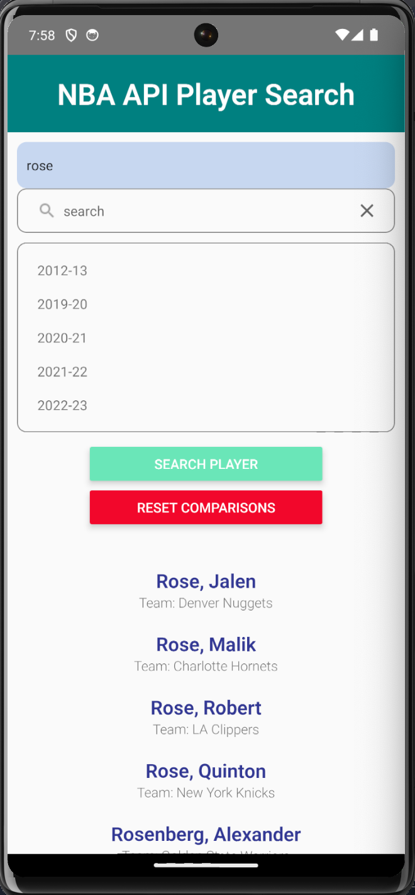
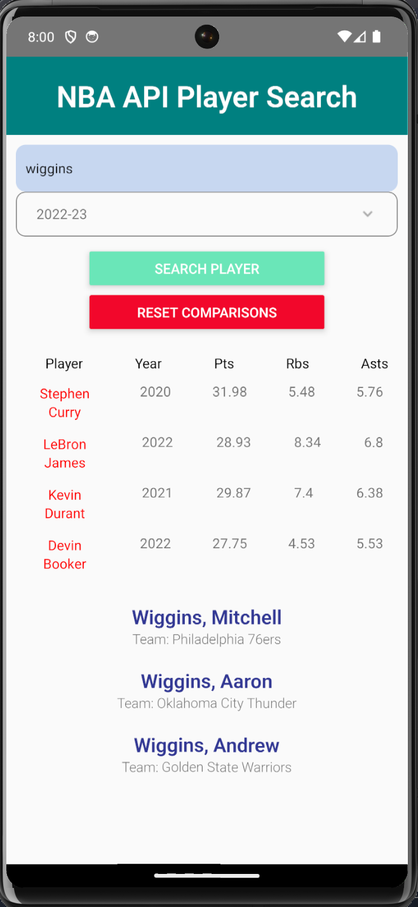

<div align="center">

# **NBA API Player Search / Comparison**

## React Native Application With NBA Player Search & ComparisonFunctionality

</div>

<br />

## Tech Stack

<code></code>
&nbsp;

## Build Setup

```bash
# run the main server
npm run start

# run the android server
npm run android

# run the ios server
npm run ios
```

## Visuals

<div align="center">




</div>

## API documentation

Sample Endpoints:
https://www.balldontlie.io/api/v1/stats?player_ids[]=1043&end_date=2023-06-02&per_page=100
https://www.balldontlie.io/api/v1/players?search=stephen%20curry&per_page=15

Documentation:
https://www.balldontlie.io/home.html#considerations-4

## Deploys

In Progress

## Contributing

Feel free to dive in! [Open an issue](https://github.com/noahfajarda/snapz/issues/new) or submit PRs.

## Licensing

[](https://opensource.org/licenses/MIT)

## Questions

If you have any questions or concerns, please contact me through my email below:

noahfajarda1@gmail.com

or through my github:

[https://github.com/noahfajarda](https://github.com/noahfajarda)
